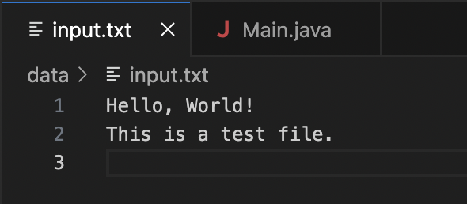
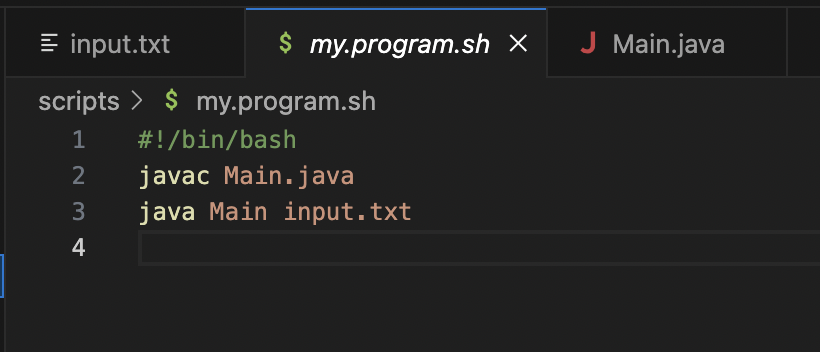
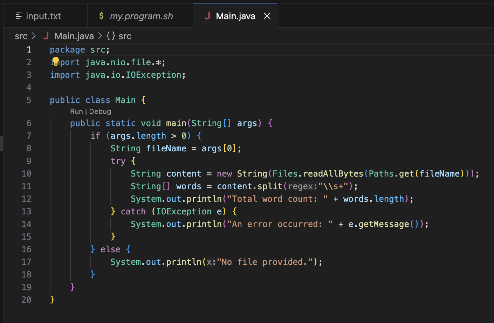
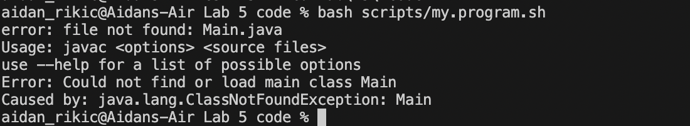
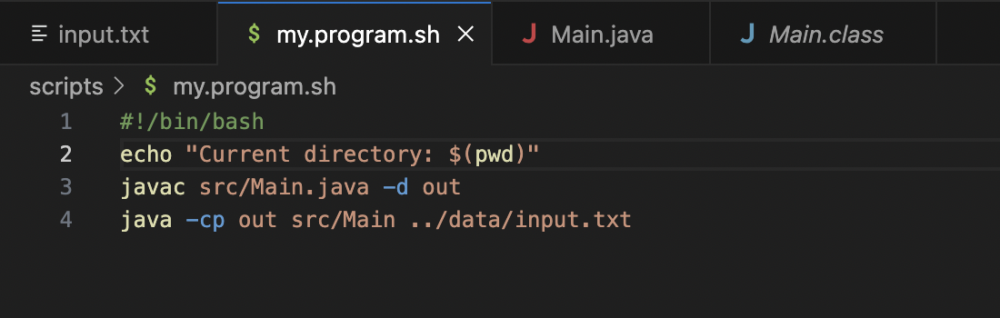
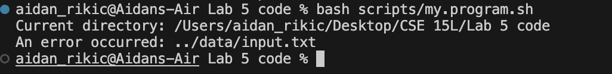
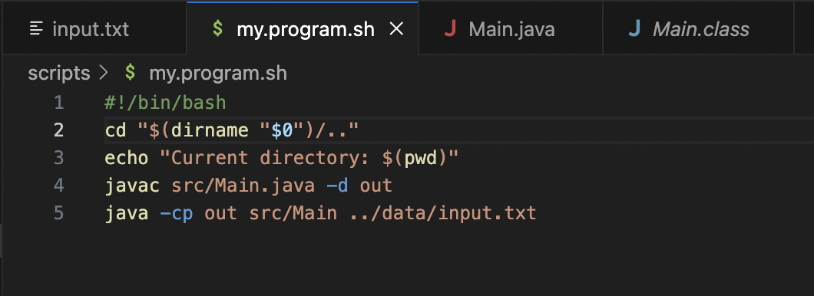

# Lab 5 
## Aidan Rikic

## Part 1  
Post from student:  
I'm having trouble with a Java program that is supposed to read input from a text file, process the data to count the number of words in the file, and print the word count to the terminal. I wrote a bash script to compile and run the program, but it seems like the program is not reading the input file correctly or processing the data as expected.  

I think the issue might be with the file path or the way the script handles the arguments, but I’m not sure. Here is my setup:  

  
  
  

When I run bash scripts/my_program.sh, I get the following output:  
  

Response from Ta:  
Hi there! Thanks for providing detailed information. Firstly, your javac and java lines in the script don't have the correct paths, they just have the final destination. You should check the paths they need to run. It also looks like you might be running into an issue with the working directory when your script executes the Java program. Could you try adding a command to print the current directory at the beginning of your bash script? Then could you run it again and share the output?  

Students follow up:  
I changed the paths for the two commands and added the pwd command to my script. Here’s the updated script and the output:  

  
  

I think the script is being run from my home directory instead of the project directory. 

TA final response:  
Thanks for the output! It confirms that the script is being executed from your home directory, not the project directory. To fix this, you need to change your bash script to navigate to the correct directory before compiling and running your Java program.

You can do this by adding a cd command to your script to change to the script’s directory, then navigate to the project root. Good Luck!  

Student final response:  
I added the cd command to my script and now it works! Heres the script:  
  
Thank you so much for the help!  

## Part 2  
In this lab I learned a lot of helpful commands I can use to navigate my desktop, my files, and my code more efficiently. I learned how useful and easy using jdb is to help look at different outputs of code at different lines in the code. I also learned how to use bash scripts to help make personalized commands that can help us in writing code.  
