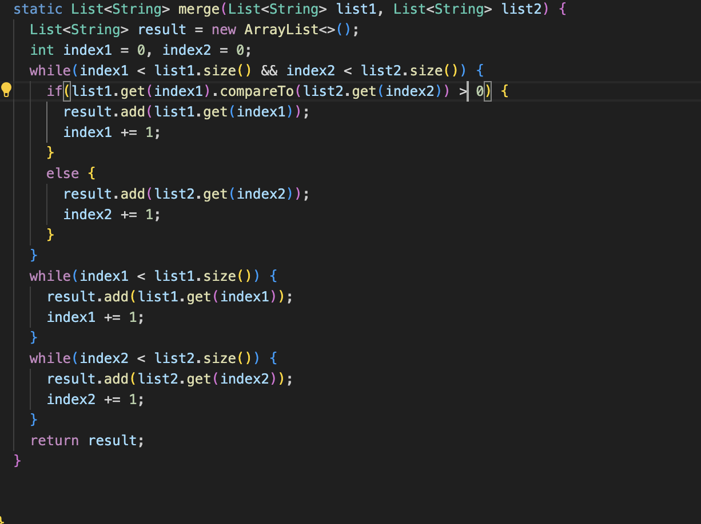
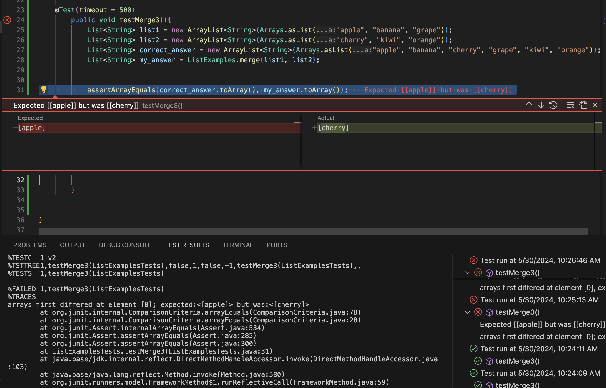
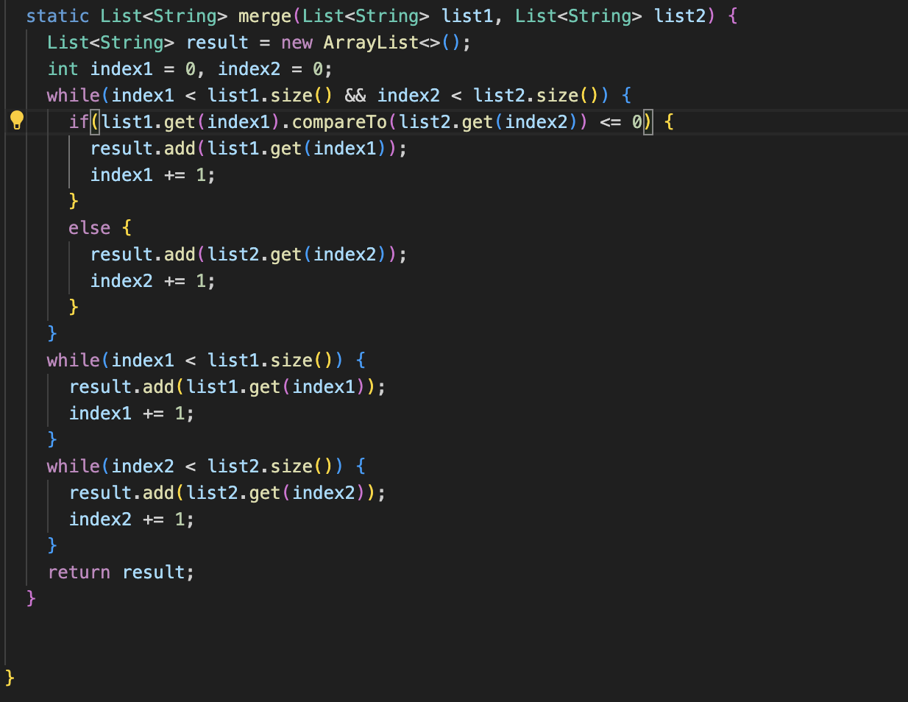

# Lab 5 
## Aidan Rikic

## Part 1  
Post from student:  
Student: Hey everyone, I'm having trouble with my merge method implementation. I'm trying to merge two sorted lists of strings, but the output 
is not coming out as expected. Here's my code:  
  
I'm not sure what's causing the issue. Any help would be appreciated!  

TA Leading question:  
TA: Hi there! Thanks for reaching out. From your code, it seems like you're on the right track. Let's try to debug the issue.
Could you provide an example of the input lists you're using and the expected output? Also, have you encountered any error messages or exceptions while running your code?  

Response from student:  
Student: Thanks for your response! Here's an example of the input lists I'm using:  
  
The expected output should be: ["apple", "banana", "cherry", "grape", "kiwi", "orange"]. 
However, when I run the code, the output is ["cherry", "kiwi", "orange", "apple", "banana", "grape"]. 
It seems like the elements from list2 are not being inserted correctly.  

TA Response:  
TA: Thanks for providing the example. It looks like the issue might be with the comparison in your if statement.
Let's try a small modification to your code. Could you change the comparison operator from > to <= in the if statement and see if that resolves the issue?  

Response from student: 
Student: I made the change you suggested, and it worked! Here it is:  
  
The output is now ["apple", "banana", "cherry", "grape", "kiwi", "orange"]. Thank you so much for your help!  
  
Info about setup:  

## Part 2  
